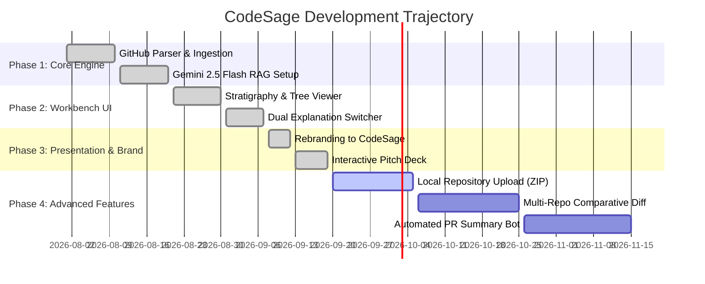

---
tags:
  - roadmap
  - tracking
  - changelog
  - sprints
last_updated: 2026-09-19
current_sprint: Sprint 06 - Polish & Extended Exporters
---

# 📈 Progress Tracker & Engineering Roadmap

## 🏁 What Is Done Till Now (The Changelog)

### Phase 3: Brand Evolution & Presentation Integration (Sept 2026)
- [x] **Complete Rebranding:** Migrated identity from `RepoGPT-RAG` to **`CodeSage`** across UI components, headers, PRD, and meta descriptors.
- [x] **Light/Dark Interactive Pitch Deck:** Built `PresentationMode.tsx` with a 7-slide interactive pitch deck (Topic, Problem, Specs, Architecture, Usability, Contributions, References) featuring full-screen toggle, keyboard controls (`F`, arrow keys), and custom light/dark styling.
- [x] **Lithos Spotlight Hero:** Implemented an interactive mouse-tracking spotlight canvas with geological stratigraphy theme and direct scroll-to-workbench routing.

### Phase 2: Grounded RAG & Codebase Geology (Aug 2026)
- [x] **Dual Explanation Mode:** Integrated user-facing toggle between **Technical Architecture** (class structures, API routes) and **Simplified Plain English** (concepts, metaphors).
- [x] **Language Stratigraphy Engine:** Computed exact byte-level language percentages and animated visual progress bars.
- [x] **Interactive Tree Explorer:** Collapsible tree viewer supporting directory expanding, file badges, and entry-point focus tags.
- [x] **Express Backend Proxy:** Unified Express server running Vite middleware in dev and `dist/` static files in production.

### Phase 1: Inception & Core Pipelines (Aug 2026)
- [x] Initialized Vite + React + Tailwind + TypeScript architecture.
- [x] GitHub REST API integration for tree ingestion and metadata parsing.
- [x] Provisioned Gemini 2.5 Flash integration via `@google/genai`.

---

## ⚡ Current Sprint Tasks (Active Workstream)

> [!todo] Active Sprint Focus
> - [ ] Add PDF export capability for the interactive Pitch Deck (`PresentationMode.tsx`).
> - [ ] Add persistent repository history in `localStorage` so users can switch between recently analyzed repositories without re-fetching.
> - [ ] Enable branch switching selector for multi-branch repositories.
> - [ ] Implement inline code snippet previews for selected files directly in the File Tree.

---

## 🗺️ Future Roadmap

### Phase 4: Enterprise & Deep Code Inspection (Backlog)
- [ ] **Private Repository OAuth:** Allow personal access token (PAT) or GitHub App authentication to inspect private company repositories.
- [ ] **Comparative Codebase Diffs:** Upload two repositories or branches side-by-side to visually inspect architectural deviations.
- [ ] **Direct ZIP Archive Ingestion:** Allow drag-and-drop local folder/ZIP upload without requiring a public GitHub remote.
